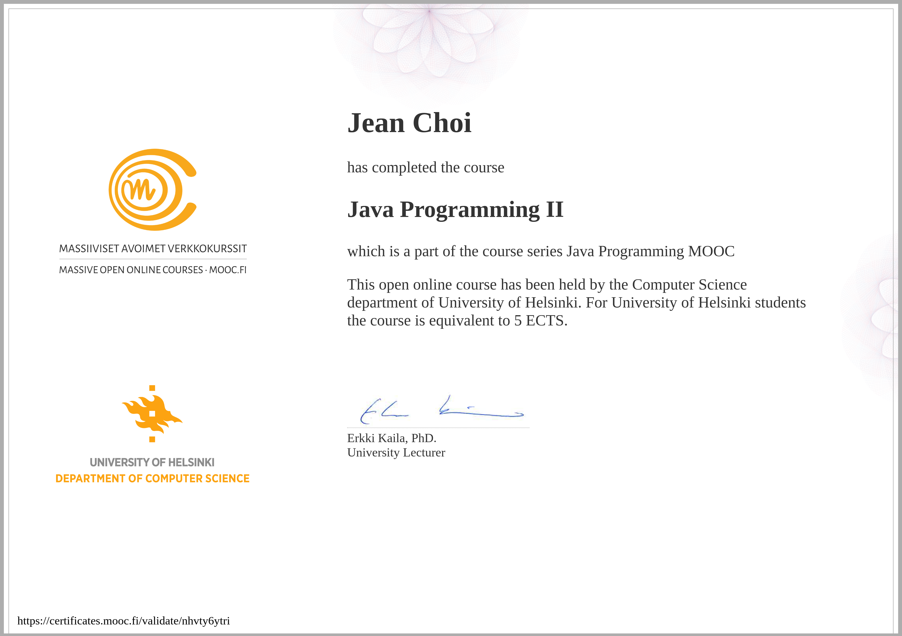

# University of Helsinki's MOOC Java Programming II
Solutions to part 2 of the University of Helsinki's MOOC Java Programming course (2013 version). All exercises for part 2 are listed.
All solutions are my own and may not be the most efficient solution. Should only be used for comparison and education
purposes. 

## Description
From the official [University of Helsinki's site: ](https://moocfi.github.io/courses/2013/programming-part-2/)

> This course is a direct continuaton of the course Object-Oriented Programming with Java, part I (including week numbering). In Part II, we will dwell deeper into the world of object-oriented programming. The course includes comprehensive course materials and plenty of programming exercises, each tested using our automatic testing service Test My Code.

This is a 2 part course. My solutions for MOOC Java Programming part 1 can be found [here](https://github.com/jeanchoi62/mooc-java-programming-i)

